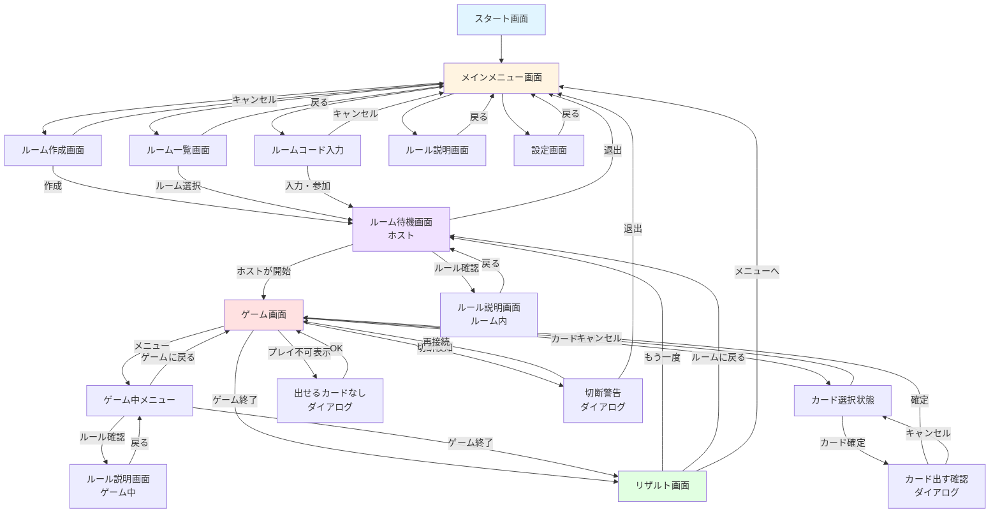

## 📊 遷移図の補足説明

### 主要な遷移パターン

**1. 新規ルーム作成の流れ**
- メインメニュー → ルーム作成 → ルーム待機（ホスト） → ゲーム → リザルト

**2. 既存ルーム参加の流れ**
- メインメニュー → ルーム一覧 → ルーム待機 → ゲーム → リザルト
- メインメニュー → コード入力 → ルーム待機 → ゲーム → リザルト

**3. ゲーム中の分岐**
- ゲーム画面 ⇄ ゲーム中メニュー ⇄ ルール確認
- ゲーム終了時 → リザルト → 再戦 or メニューへ

### 色分けの意味
- 🔵 **水色**: スタート画面
- 🟡 **黄色**: メインメニュー
- 🔴 **赤色**: ゲーム画面
- 🟢 **緑色**: リザルト画面
- 🟣 **紫色**: ルーム待機画面

## 🎮 ゲーム画面内の遷移の説明

### 追加した遷移

**1. カードプレイの流れ**
- ゲーム画面 → カード選択状態 → 確認ダイアログ → ゲーム画面

**2. プレイ不可の状態**
- 出せるカードがない場合 → ダイアログ表示 → ゲーム画面に戻る
- パスやスキップのアクション

**3. 切断・エラー処理**
- 通信切断検知 → 警告ダイアログ → 再接続 or 退出

**4. ゲーム中メニュー**
- 一時停止 → メニュー表示 → ゲームに戻る/ルール確認/終了

---